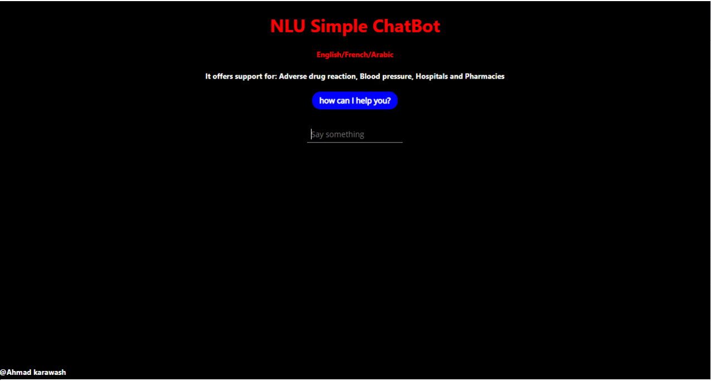

# Simple_Chatbot_NLU
A basic multi-lingual Chatbot in Natural Language Understanding with ReactJS frontend and Python backend REST API

## Steps to run the backend and frontend code

### Backend
install Python 3

install packages: pip install nltk pickle numpy pandas json keras flask flask_restful flask_cors flasgger

cd backend

run python code: pyhton api.py

### Frontend
install node.js

cd frontend

install required packages: npm install

run ReactJS code: npm start
